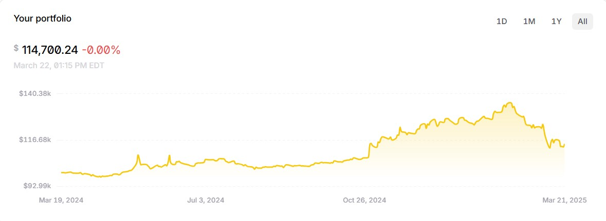
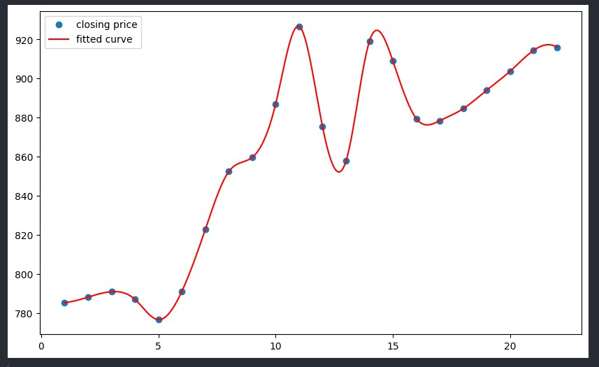
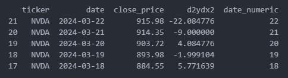

# pystocks_algo_v1

This Python bot trades stocks based on technical analysis. I got the idea for this strategy from one of my economics professors in college. The strategy is to use the second derivative as an indicator for buy and sell signals; when the 2nd derivative hits an inflection point and goes from negative to positive, we interpret this as the potential emergence of an upward sloping curve in the function and therefore an increase in the stock's price. 

This strategy isn't perfect, as the accuracy of back-tests will be skewed since the closing price of day(X) heavily influences d2ydx2 of day(X-1). Regardless, I enjoyed the project and learned alot in its creation. 

## Plot Example 
 
- Unforunately this is paper money.
- The bot has performed well, but this is mostly due to the fact that I only tested it with blue chip stocks that have performed well in the market the last year or so.

## Plot Example 
 
- Here's what the plot looks like with the fitted curve.

## Performance 
 
- Here's how the bot is evaluation what to buy and sell.